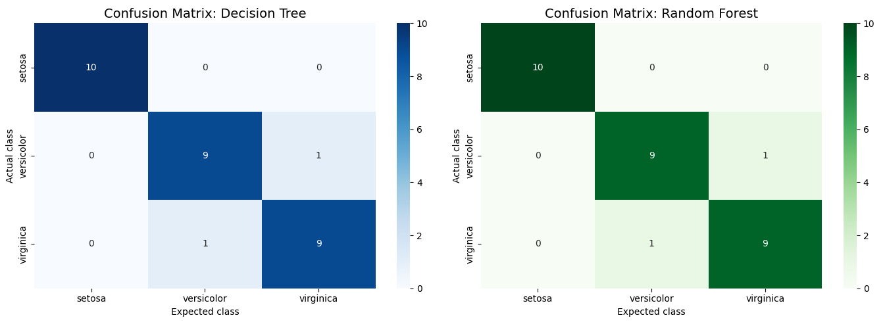
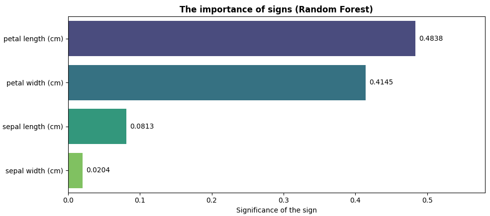

# Tree-Based-ML-Classifier

## Description
The goal of this project is to implement, evaluate, and mathematically compare tree-based Machine Learning algorithms—specifically Decision Tree and Random Forest classifiers—using the classic Iris dataset.

This project addresses the need to understand the interpretability and transparency of machine learning models. By extracting feature importances and visualizing the algorithmic decision-making nodes, the project clearly demonstrates which specific biological characteristics (e.g., petal length vs. sepal width) carry the most mathematical weight in classification, effectively identifying and filtering out redundant data noise.

### Technologies Used
* **Python** — core programming language.
* **Scikit-learn** — utilized for the core Machine Learning pipeline: dataset loading, automated train-test splitting (with stratification), model training (`DecisionTreeClassifier`, `RandomForestClassifier`), and calculating comprehensive evaluation metrics.
* **NumPy** — used for efficient array manipulations and mathematical sorting of feature importances.
* **Matplotlib & Seaborn** — applied for generating high-quality data visualizations, including heatmap-based confusion matrices, feature importance bar charts, and plotting the actual decision tree nodes.

### Results
The program successfully trained both the Decision Tree and Random Forest models, achieving high classification accuracy (>90%). Through rigorous statistical evaluation (Accuracy, Precision, Recall, F1-score, and Confusion Matrices), the script highlighted the exact mathematical overlap between the *versicolor* and *virginica* classes. Furthermore, the analysis successfully proved that petal characteristics contain over 87% of the required informational value for accurate classification, rendering sepal measurements mathematically redundant in this specific context.

### Visualization
The Python script automatically generates detailed visual reports to interpret the inner workings of the trained models.

<p align="center">
  <table>
    <tr>
      <td align="center" width="50%">
        <b>Model Confusion Matrices</b><br><br>
        <br>
        <sub>Comparing misclassifications between DT and RF models</sub>
      </td>
      <td align="center" width="50%">
        <b>Feature Importance Analysis</b><br><br>
        <br>
        <sub>Evaluating the mathematical weight of each dataset feature</sub>
      </td>
    </tr>
  </table>
</p>

## Quick Start Guide

### 1. Download the File
Clone or download this repository to your local machine, ensuring you have the main Python script `Ex_5.py`.

### 2. Install Dependencies
The script relies on fundamental data science and machine learning libraries. Ensure you have Python 3.8+ installed, then open your terminal or command prompt and execute:
```bash
pip install numpy matplotlib seaborn scikit-learn
```
### 3. Execute the Analytics Pipeline
Run the Python script to train the models, output the detailed statistical metrics to the console, and render the analytical plots:
```bash
python Tree-Based-ML-Classifier.py
```
(The script will sequentially open the plotted figures: the Decision Tree structure, the Confusion Matrices, and the Feature Importance chart).


